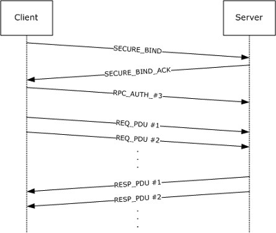

# MS-EVEN6 Implementation

## EventLog Stack

The EventLog Remoting Protocol Version 6.0
[MS-EVEN6](https://docs.microsoft.com/en-us/openspecs/windows_protocols/ms-even6),
originally available in the Windows Vista operating system, is a remote
procedure call (RPC)–based protocol that exposes RPC methods for reading
events in both live event logs and backup event logs on remote computers.
The client MUST use RPC over TCP/IP (that is, ncacn_ip_tcp), as specified
in [MS-RPCE](https://docs.microsoft.com/en-us/openspecs/windows_protocols/ms-rpce),
as the RPC protocol sequence to communicate with the server.
The higher-level protocol or client application MUST specify the Simple and
Protected GSS-API Negotiation Mechanism, NTLM, or Kerberos as the RPC
authentication service, as specified in
[MS-RPCE](https://docs.microsoft.com/en-us/openspecs/windows_protocols/ms-rpce),
and the protocol client MUST pass this choice unmodified to the RPC layer.
Our implementation stack is TCP | MS-RPCE | MS-EVEN6 with NTLM
as security provider.

## Endpoint Mapper

The RPC endpoint mapper allows RPC clients to determine the port number
currently assigned to a particular RPC service, in this case MS-EVEN
service. RPC Endpoint Mapper process listens on TCP/IP port 135. We
use mapper's map RPC method to determine the port number of MS-EVEN
service.

## PDU

RPC Protocol Data Units (PDU) is used for RPC messages

| PDU                     |
| ----------------------- |
| PDU Header              |
| PDU Body                |
| sec_trailer             |
| authentication token    |

## Binding

Packet Sequence for Secure, Connection-Oriented RPC Using NTLM as Security Provider.



SECURE_BIND is a BIND message with authentication token = NTLM Type1 message

SECURE_BIND_ACK is BIND ACK message with authentication token = NTLM Type2 message

RPC_AUTH_#3 is AUTH3 message with authentication token = NTLM Type3 message

More details about NTLM authentication can be found at
[The NTLM Authentication Protocol and Security Support Provider](http://davenport.sourceforge.net/ntlm.html)

## NTLMv2 session security

NTLMv2 session security is documented in
[http://davenport.sourceforge.net/ntlm.html#ntlm2SessionSecurity](http://davenport.sourceforge.net/ntlm.html#ntlm2SessionSecurity)
The request and response messages are secured by applying the following
protection to the different PDU segments.


| Authentication level | PDU header | PDU body | sec_trailer |
| -------------------- | ---------- | -------- | ----------- |
| RPC_C_AUTHN_LEVEL_PKT_INTEGRITY |  Integrity | Integrity | Integrity |
| RPC_C_AUTHN_LEVEL_PKT_PRIVACY | Integrity | Confidentiality | Integrity |

In INTEGRITY authentication level, the signature is computed for PDU header+PDU body+sec_trailer bytes. The corresponding signature is placed in
PDU's authentication token.

In PRIVACY authentication level, apart from the above, the body is encrypted.

## MS-EVEN6 RPC

* The client calls the ```EvtRpcRegisterRemoteSubscription``` method to
establish a subscription connection and to obtain a subscription
context and operation control handles.
```
    [op(0x00)]
    error_status_t EvtRpcRegisterRemoteSubscription(
        [in] LPCWSTR channelPath,
        [in] LPCWSTR query,
        [in] LPCWSTR bookmarkXml,
        [in] DWORD flags,
        [out] policy_handle* handle, 
        [out] policy_handle* control,
        [out] DWORD* queryChannelInfoSize,
        [out] EvtRpcQueryChannelInfo** queryChannelInfo,
        [out] RpcInfo *error);

    For example:

    EvtRpcRegisterRemoteSubscription subscription = new EvtRpcRegisterRemoteSubscription(
        "Security", "*", null, EvtSubscribeStartAtOldestRecord);
```
* gets the subscription handle, it calls the Pull subscriptions are subscriptions in which the client requests records. The requests can be done by using a polling mechanism. EvtRpcRemoteSubscriptionNext method to fetch its subscribed events. The server returns the event or Once the client
events, and then update its subscription object state to keep track of what events have been delivered to the subscription.
```
    [op(0x01)]
    error_status_t EvtRpcRemoteSubscriptionNext(
        [in] policy_handle* handle,
        [in] DWORD numRequestedRecords,
        [in] DWORD timeOut,
        [in] DWORD flags,
        [out] DWORD* numActualRecords,
        [out] DWORD** eventDataIndices,
        [out] DWORD** eventDataSizes,
        [out] DWORD* resultBufferSize,
        [out] BYTE** resultBuffer);

    For example:

    EvtRpcRemoteSubscriptionNext pull = new EvtRpcRemoteSubscriptionNext(
        subscription.handle, 5 , 5000, 0 );

    events = 5 indices = [0, 1806, 5054, 7336, 10562] sizes = [1805, 3247, 2281, 3225, 2281] buffer size = 12843
    Nicely, all the events line up in the returned buffer
    +---------------+----------------+--------------------+--------------+----------------+
    |x|x| ..  |x|x|x|x| ...    |x|x|x|x|... |x|x|... x|x|x| ...                           |
    +---------------+----------------+--------------------+--------------+----------------+
    0    event1   1806   event2    5054     event3       7336  event4  10562  event5
```
* A implementation can call above method ```EvtRpcRemoteSubscriptionNext```
  in three ways:
  * Periodically
  * Using EvtRpcRemoteSubscriptionWaitAsync
  * or both of the above
    
   1. This is straightforward, say invoking ```EvtRpcRemoteSubscriptionNext```
   periodically 3 secs. The implementation is easy and there is no need to
   worry about half-closed TCP connections. But polling may generate
   unnecessary traffic. Also, the events are fetched at polling interval and
   that means latency.

   2. The ```EvtRpcRemoteSubscriptionWaitAsync``` method can be used to enable
   the client to only poll when results are likely, and is typically used in
   conjunction with the EvtRpcRemoteSubscriptionNext method, which is a
   blocking call; so this asynchronous method is used to provide a
   way for the caller to not have to block or continuously poll the server.
   Our impl opens one more TCP connection and invokes
   ```EvtRpcRemoteSubscriptionWaitAsync``` and that triggers the invocation
   of ```EvtRpcRemoteSubscriptionNext``` method to fetch its subscribed
   events. The impl associates both connection same context by using bind
   packet's assoc group. The advantage of opening a new connection is to
   detect abrupt closing of TCP connections by using socket read timeout.
   If there are no events in the specified timeout period, the current
   connection is closed and a new connection is opened for
   ```EvtRpcRemoteSubscriptionWaitAsync``` invocations. One disadvantage is
   if the TCP connection for ```EvtRpcRemoteSubscriptionWaitAsync``` is
   half-closed, we don't get the events until read timeout.

   3. In addition to ```EvtRpcRemoteSubscriptionWaitAsync``` trigger for
   ```EvtRpcRemoteSubscriptionNext``` invocation, the impl can also use a
   timer as an additional trigger. This can reduce number connection closures
   by specifying a larger socket read timeout, yet fetching events in timely
   manner when the second TCP connection is broken. The timer part is not
   implemented.

## Design considerations

Push subscriptions seems attractive because low latency, but doesn't detect
TCP broken connections (as the socket is stuck in read() call). If we
use a socket read timeout and if there are no events in that time period,
we need to create a new connection (as a pending request as far as
server is concerned)Normal pull subscriptions work ok, but polling may
generate unnecessary traffic. Also, the events are fetched at polling
interval and that means latency.

## BinXml

RPC message's payload is formatted in [BinXml](https://docs.microsoft.com/en-us/openspecs/windows_protocols/ms-even6/c73573ae-1c90-43a2-a65f-ad7501155956).
A recursive-descent parser is built to parse BinXml and a xml node tree.
Node tree is processed with template substitutions recursively to produce xml.

## API

A high-level abstraction for event log scraping is implemented. It is modeled
after .NET API, like [EventLogWatcher](https://docs.microsoft.com/en-us/dotnet/api/system.diagnostics.eventing.reader.eventlogwatcher?view=dotnet-plat-ext-3.1), EventLogQuery etc.

## Enhancements to JCIFS project

* Support of ncacn_ip_tcp urls
* TCP transport
* Endpoint Mapper supportSecure_Bind, Secure_Bind_Ack, Auth3 messages
* NTLMv2 session security
* MS-EVEN6 impl with BinXml parsingParsing logon and logoff xml events to Java
  objects
* High-level abstraction for event log scraping (modeled after .NET API, like
  EventLogWatcher, EventLogQuery etc)
  
## Maven
```
<dependency>
  <groupId>com.github.jitsni</groupId>
  <artifactId>mseven6</artifactId>
  <version>0.4</version>
</dependency>
```
## References
* [MS-RPCE](https://docs.microsoft.com/en-us/openspecs/windows_protocols/ms-rpce)
* [MS-EVEN6](https://docs.microsoft.com/en-us/openspecs/windows_protocols/ms-even6)
* [DCE/RPC](http://www.dcerpc.org/documentation/)
* [impacket](https://github.com/secureauthcorp/impacket)
